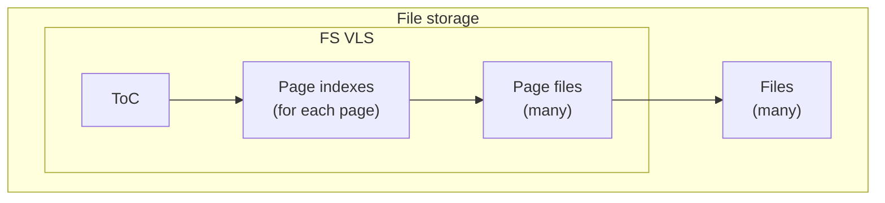
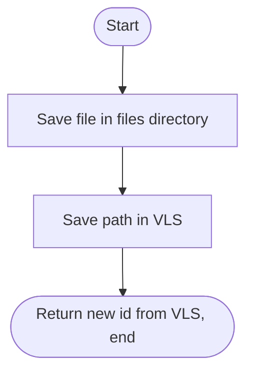
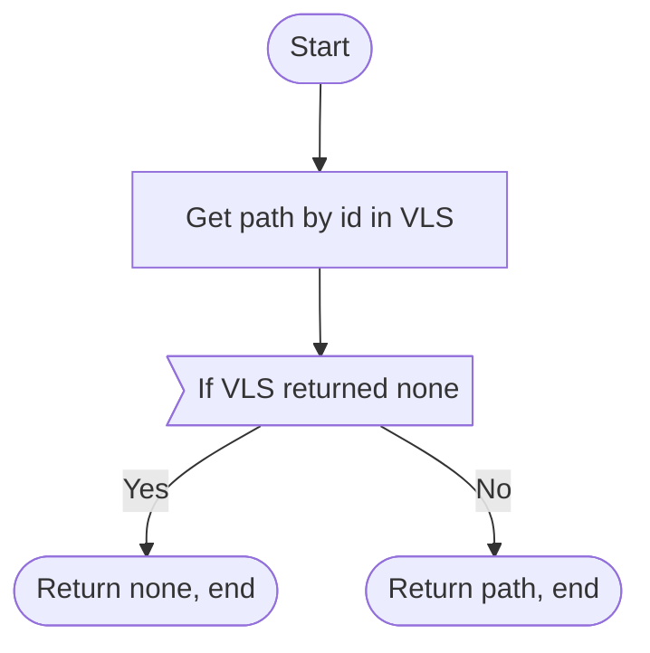
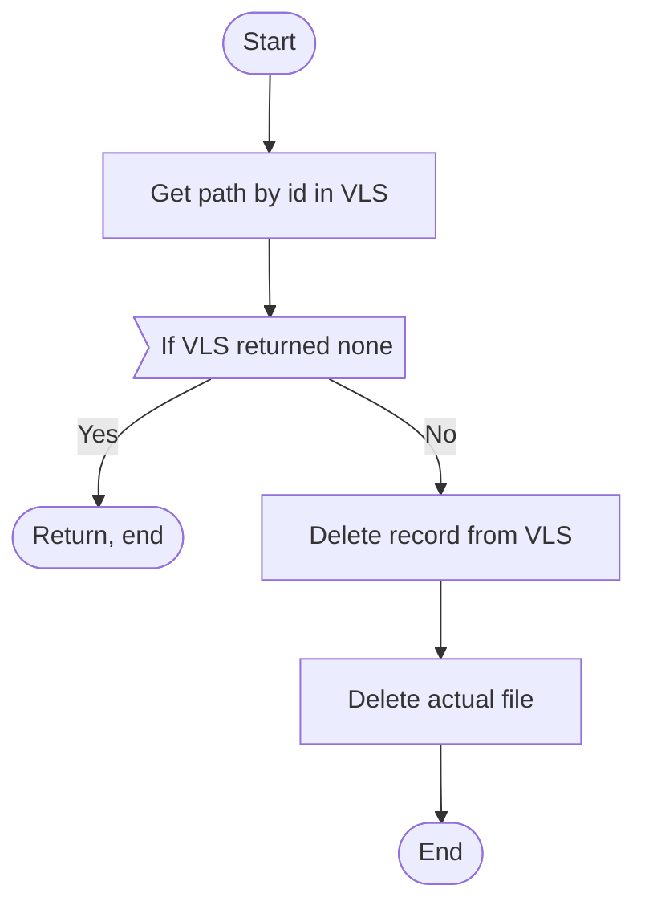

# File storage

File storage is (surprise!) intended for storing files (images, videos, audio, etc.).



Example filesystem structure:

```
root
|-  vls
    |-  toc.dat
    |-  idx0.dat
    |-  page0.dat
    |-  idx1.dat
|-  files
    |-  someFileName.someExt
    |-  someFileName.someExt
    |-  someFileName.someExt
```

File storage consists of a separate VLS and a collection of files.

File storage assigns each file an id and its VLS stores mapping from ids to filenames.

## File roles & terminology

> Please, refer to [VLS specification](./variable.md).

## File structure

> Please, refer to [VLS specification](./variable.md).

## Operations

### Add file



### Get file



### Remove file


