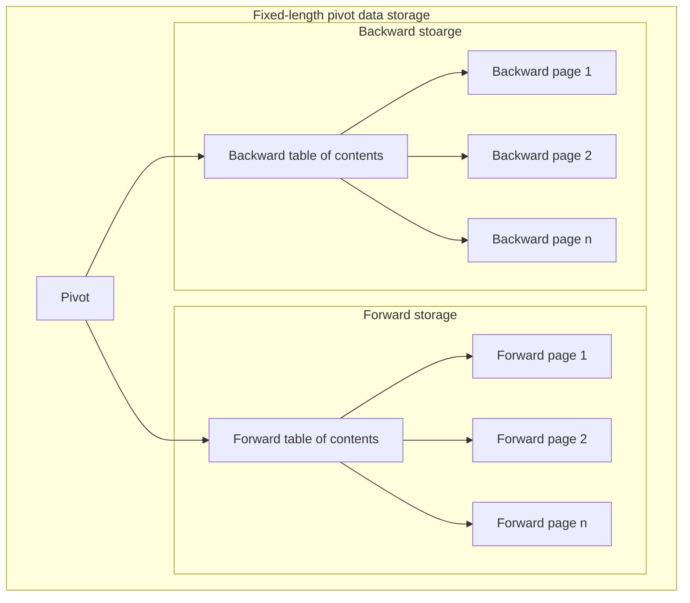
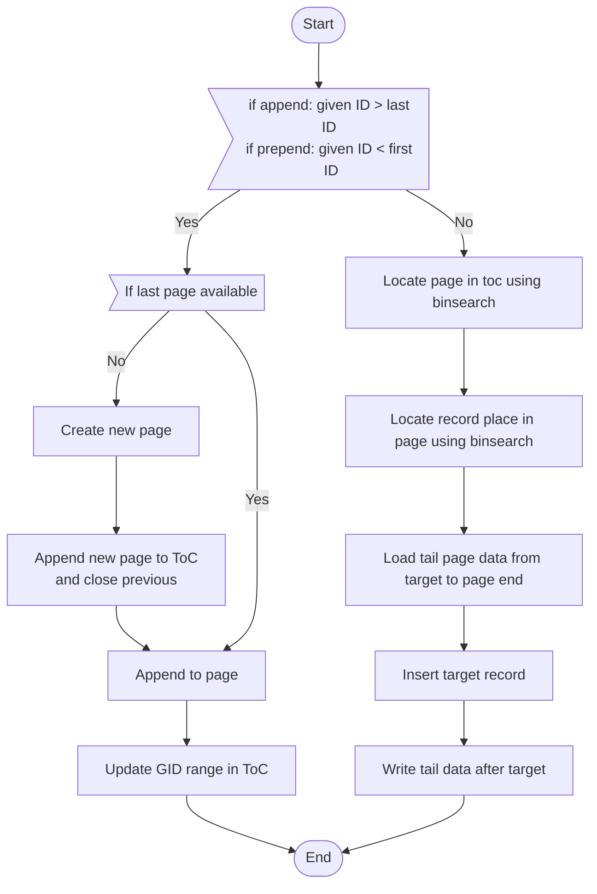
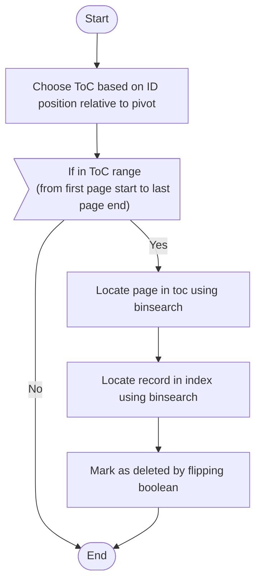
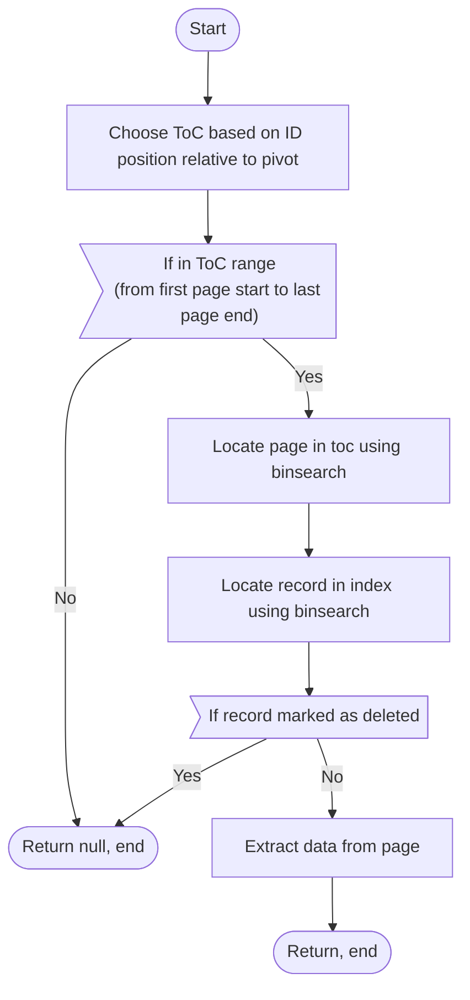
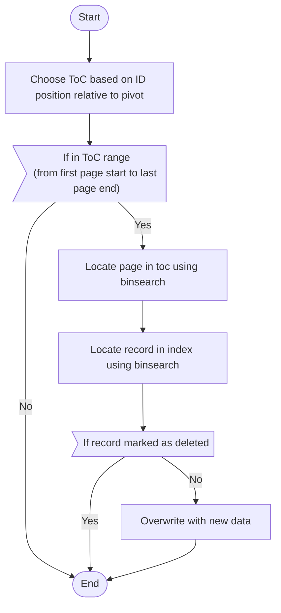

# Fixed-length pivot data storage

> (also referred to as "FPLS")

It is intended to store data that has predetermined length for each record. 
It is designed to have `O(1)` for both append and prepend operations.



Example filesystem structure:

```
root
|-  pivot.dat
|-  fwd
    |-  toc.dat
    |-  page0.dat
    |-  page1.dat
|-  bck
    |-  toc.dat
    |-  page0.dat
    |-  page1.dat
```

## File roles

FPLS has three distinct file roles:

**fpls:ToC**
:   Table of contents is a file that stores mappings
    of GID ranges and availability status to page ids.

**fpls:Page**
:   Page is a file that is a sequence of bytes of data.
    Is a continuous stream of records of fixed length.

## Terminology

**fpls:GID**
:   Global Identifier is an identifier of a string (or
    other bytes sequence) stored in VLS. Unique for a
    single VLS.

**fpls:Availability**
:   A boolean value that determines whether there a page
    could be appended with some data or not. Therefore,
    it has two values:
    
    - true = available = open
    - false = full = closed

## Principle

FPLS has a determined pivot expressed as a GID. From the pivot point there are
two sets of pages that grow in different directions. To append, you append to
the forward page set, to prepend, you append to the backward page set.

FPLS guarantees that records go in monotonic increasing order of GID.

```
                               vvv - pivot
[94, 95, 96 ]  [97, 98, 99 ]  [100, 101, 102]  [100, 101, 102]
(back page 1)  (back page 0)  (fwd page 0   )  (fwd page 1   )
<-- backward grows                           forward grows -->
```

## File structure

### Pivot

Filename `pivot.dat`

```
pivot (i64)
```

### ToC

Filename: `{{side}}/toc.dat`, e.g. `fwd/toc.dat`

```
page_count (i32)
max_page_size (i32, records)

page_0_gid_start (i64)
page_0_gid_end (i64)
page_0_availability (bool)

page_1_gid_start (i64)
page_1_gid_end (i64)
page_1_availability (bool)

...

page_n_gid_start (i64)
page_n_gid_end (i64)
page_n_availability (bool)
```

!!! attention
    Note that FPLS does not guarantee that page size will not exceed defined limit.
    This is true only if you maintain monotonic appends and prepends, i.e. 
    for each prepend operation it is true that the smallest GID is greater than 
    prepending GID and for each append operation it is true that the largest GID
    is smaller than appending GID. 

    In situations where you append a record with GID that should go somewhere 
    into the middle of a page, FPLS will neglect `max_page_size` parameter 
    in order to satisfy monotonic increasing GID invariant.

    Such operation will result in `O(max_page_size)` performance so it's discouraged
    to do it on purpose. This mechanism is designed to gracefully handle cases when
    for some reason Telegram client failed to receive some messages in between.

    As a consequence, `max_page_size` should be chosen that way, so all
    `max_page_size` records can be safely loaded to RAM and then written back.


### Page

Filename: `{{side}}/page{{page_id}}.dat`, where `page_id: i32 >= 0` (e.g. `fwd/page1.dat`).

```
(id: i64, is_deleted: bool, ...message format tuple)
(id: i64, is_deleted: bool, ...message format tuple)
...
(id: i64, is_deleted: bool, ...message format tuple)
```

> _fixed size enables us to do binary search on IDs without an index file_

## Operations

### Append / prepend



### Delete



### Retrieve by GID



### Update by GID


