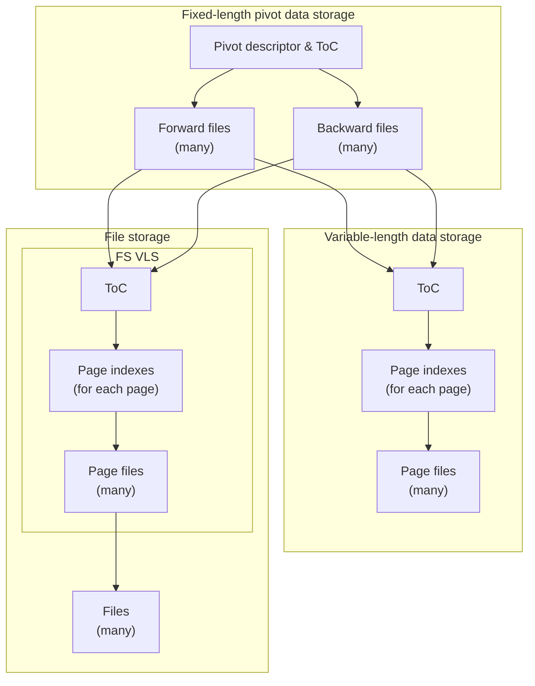

# MDB overview

To efficiently store messages on your device, Midlegram implements
its very own message database (MessageDB, or MDB for short).

The overall structure of MDB is like this:

```mermaid

flowchart
    subgraph Fixed-length pivot data storage
        pd["Pivot descriptor & ToC"]
        fwds["Forward files \n(many)"]
        bcks["Backward files \n(many)"]
        pd --> fwds
        pd --> bcks
    end
    
    subgraph Variable-length data storage
        pgs["Page files \n(many)"]
        pg_idxs["Page indexes \n(for each page)"]
        toc["ToC"]
        toc --> pg_idxs
        pg_idxs --> pgs
    end
    
    subgraph File storage
        subgraph FS VLS 
            fpgs["Page files \n(many)"]
            fpg_idxs["Page indexes \n(for each page)"]
            ftoc["ToC"]
            ftoc --> fpg_idxs
            fpg_idxs --> fpgs
        end
        fls["Files \n(many)"]
        fpgs --> fls
    end
    
    fwds --> ftoc
    fwds --> toc
    bcks --> ftoc
    bcks --> toc
```