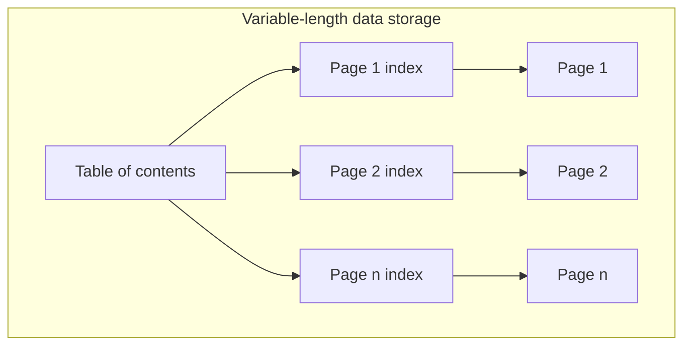
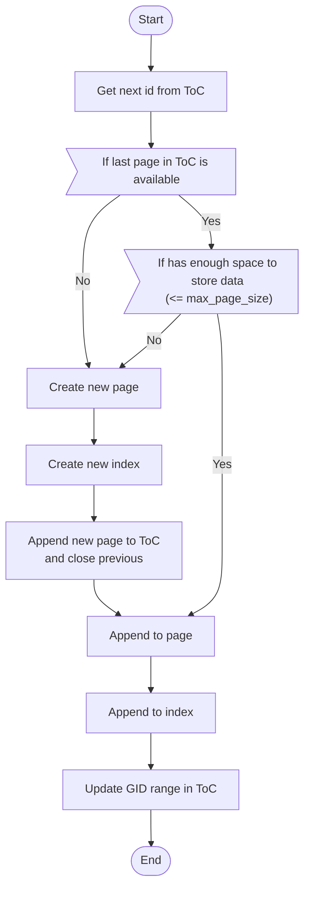
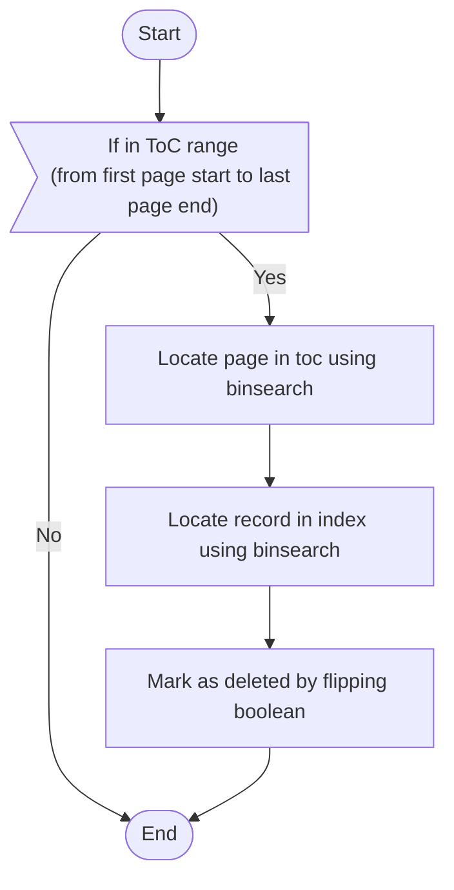
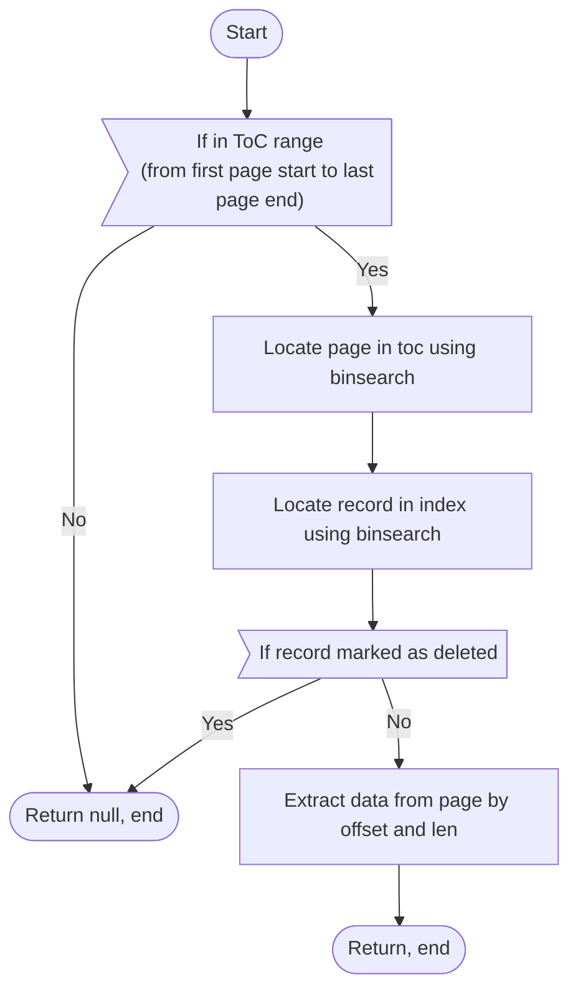
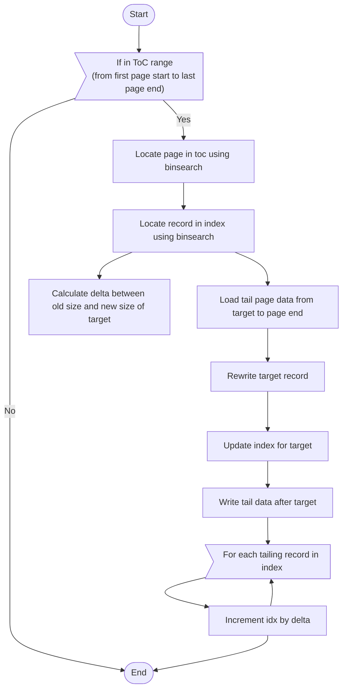
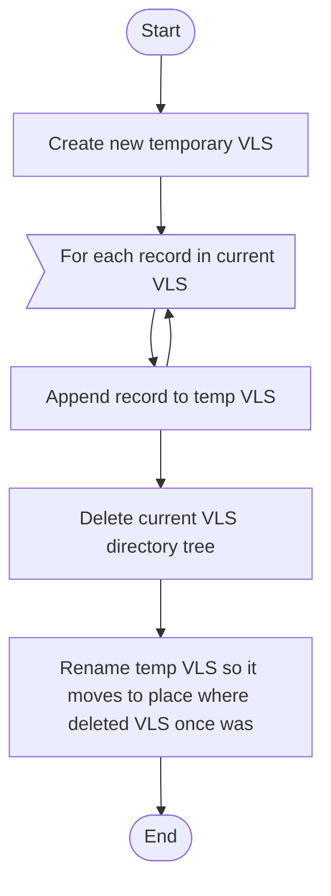

# Variable-length data storage

> (also referred to as "VLS")

It is intended to store data that does not have
predetermined length. Most commonly - strings.

It offers mechanism that's pretty similar to TOAST mechanism in Postgres,
albeit super-simplified.



Example filesystem structure:

```
root
|-  toc.dat
|-  idx0.dat
|-  page0.dat
|-  idx1.dat
|-  page1.dat
```

## File roles

VLS has three distinct file roles:

**vls:ToC**
:   Table of contents is a file that stores mappings
    of GID ranges and availability status to page ids.

**vls:Page index**
:   Page index is a file that stores information about
    offsets, lengths and GIDs of stored data pieces in
    the page it refers to.

**vls:Page**
:   Page is a file that is a sequence of bytes of data.
    Is a continuous stream, does not have neither any 
    delimiters nor any meta information.

## Terminology

**vls:GID**
:   Global Identifier is an identifier of a string (or
    other bytes sequence) stored in VLS. Unique for a
    single VLS.

**vls:Availability**
:   A boolean value that determines whether there a page
    could be appended with some data or not. Therefore,
    it has two values:
    
    - true = available = open
    - false = full = closed

## File structure

### ToC

Filename: `toc.dat`

```
page_count (i32)
max_page_size (i64, bytes)

page_0_gid_start (i64)
page_0_gid_end (i64)
page_0_availability (bool)

page_1_gid_start (i64)
page_1_gid_end (i64)
page_1_availability (bool)

...

page_n_gid_start (i64)
page_n_gid_end (i64)
page_n_availability (bool)
```

!!! attention
    `max_page_size` should be chosen that way, so all
    `max_page_size` bytes can be safely loaded to RAM and then written back.

### Page index

Filename: `idx{{page_id}}.dat`, where `page_id: i32 >= 0` (e.g. `idx1.dat`).

Stores tuples of `(gid, offset, length, deleted)` of records stored in 
corresponding page.

```
records_count (i32)

record_0_gid (i64)
record_0_offset (i64)
record_0_length (bool)
record_0_deleted (bool)

record_1_gid (i64)
record_1_offset (i64)
record_1_length (bool)
record_1_deleted (bool)

...

record_n_gid (i64)
record_n_offset (i64)
record_n_length (bool)
record_n_deleted (bool)

```

### Page

Filename: `page{{page_id}}.dat`, where `page_id: i32 >= 0` (e.g. `page1.dat`).

Stores actual records.

```
record_0_bytes (length and offset determined by index)
record_1_bytes (length and offset determined by index)
...
record_n_bytes (length and offset determined by index)
```

## Operations

### Append



### Delete



### Retrieve by GID



### Update

Although not recommended, VLS can do updating. 
Updating is always `O(max_page_size)` of both memory and time.

To update faster, just delete the old record and append a new,
then refer to new GID.



### Defragmentation

Get rid of blanks that are left from deletion of old elements.

!!! warning
    This is a very heavy operation, as it requires a full rewrite of the VLS.


